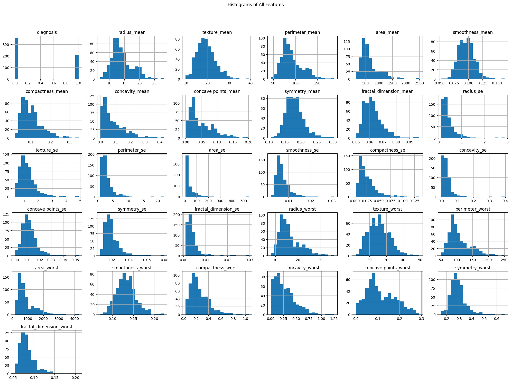
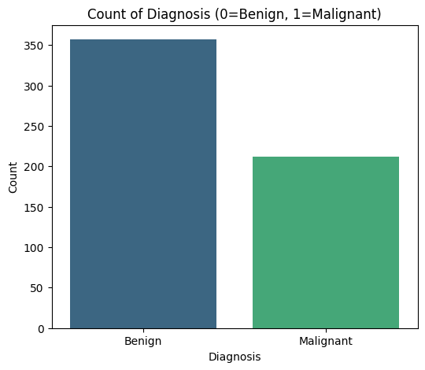
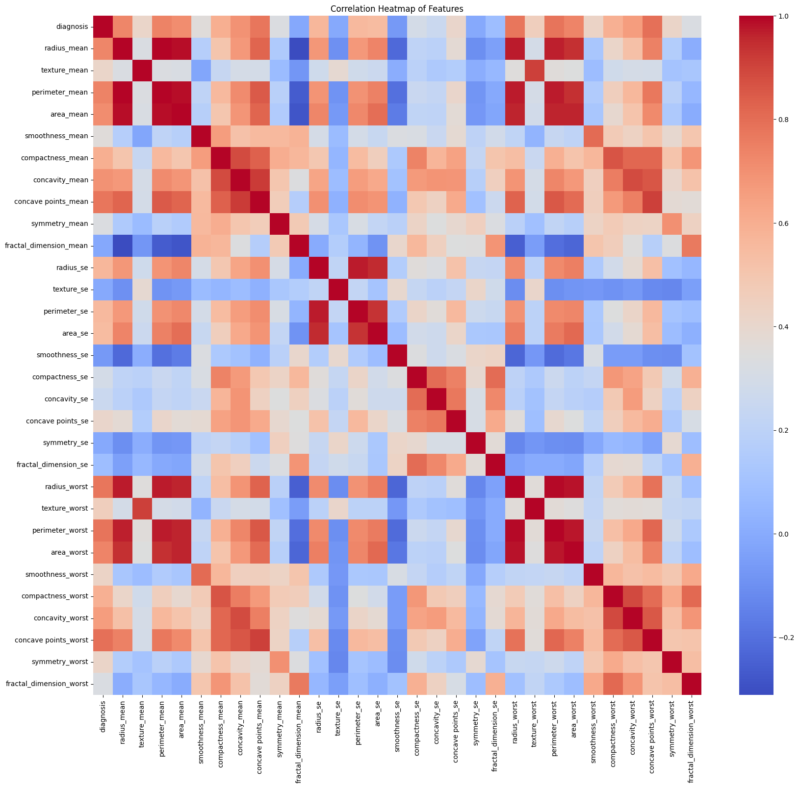
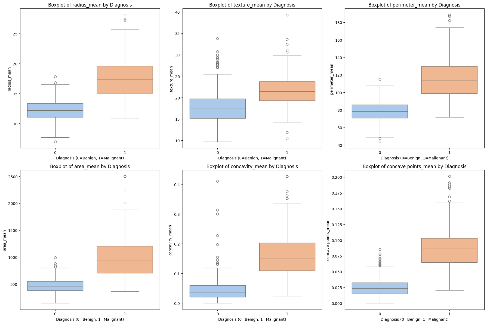
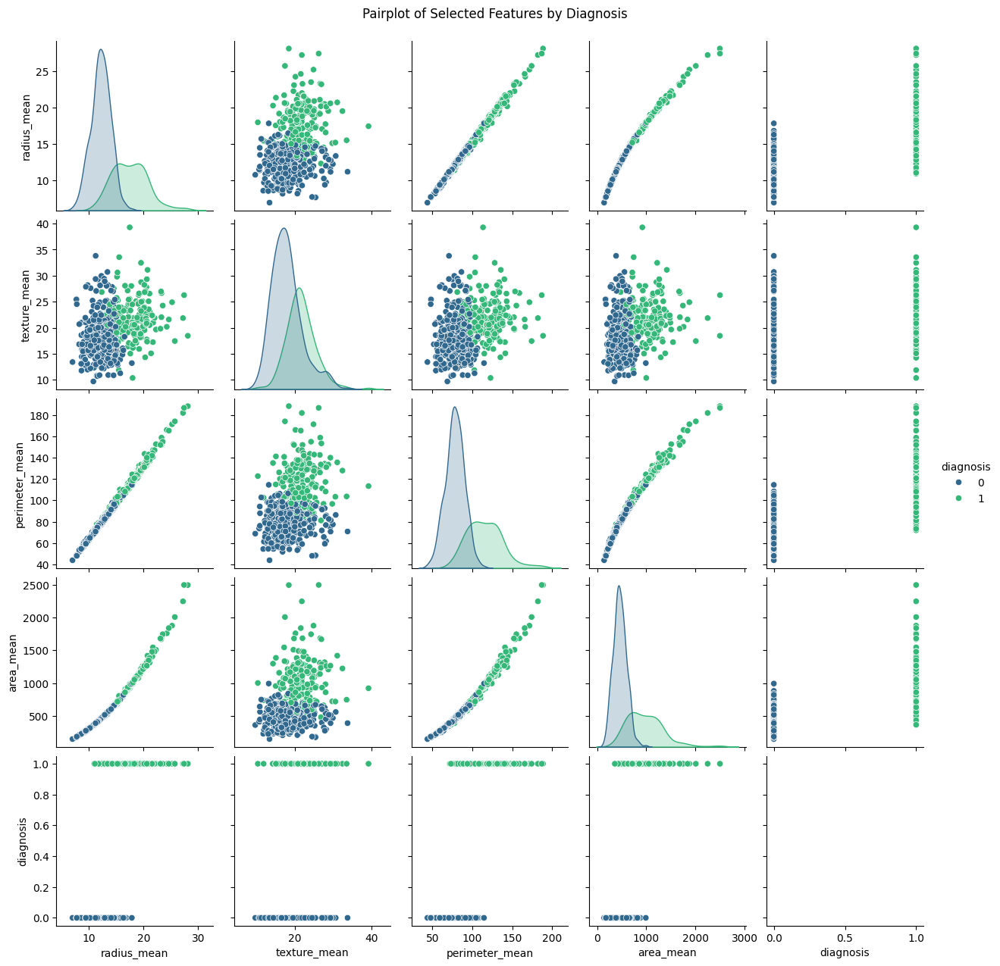
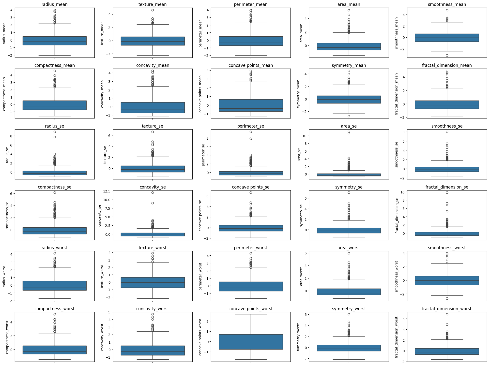
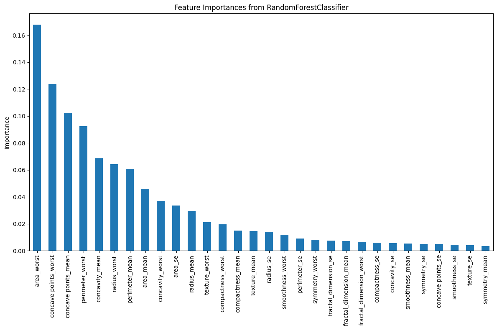

# PredictiveProject2
Breast Cancer Tumor Classification Using Clinical Features

# Team Members
| Name | Register No. |
| ------- | -------- | 
| Akshaya K P | 253214 |
| Aparna Sreenivasan | 253204 |
| Sravana Nambiar | 253212 |

**Dataset Information**

The dataset used is the Breast Cancer Wisconsin Diagnostic Dataset.

## Dataset Shape

before preprocessing

- Rows: 569  
- Columns: 33 

After preprocessing:

- Rows: 569  
- Columns: 31

## Target Variable

The target column is: diagnosis

This column represents whether the tumor is:

- M → Malignant (Cancerous)

- B → Benign (Non-cancerous)

After label encoding:

- Benign (B) = 0

- Malignant (M) = 1

Distribution of Target Variable

- Benign cases: 357

Malignant cases: 212

# Exploratory Data Analysis
# Histogram of all features

# Count plot for analysis

# Correlation Heatmap

# Boxplots for Key Features by Diagnosis

# Pairplots for Selected Features

# Outlier Detection

# Model-based Feature Importance Analysis

# Model Training
Models Used
Logistic Regression
A linear model suitable for binary classification problems.

Support Vector Machine (SVM)
Finds the optimal hyperplane that separates the two classes.

Random Forest
An ensemble model that combines multiple decision trees.

# Evaluation metrics
| Model | Accuracy | Precision | Recall | F1 Score | ROC-AUC |
|------|---------:|----------:|-------:|---------:|--------:|
| Logistic Regression | 0.964912 | 0.952381 | 0.952381 | 0.952381 | 0.996032 |
| SVM | 0.982456 | 1.0000 | 0.952381 | 0.975610 | 0.996032 |
| Random Forest | 0.973684 | 1.0000 | 0.928571 | 0.962963 | 0.995205 |
**Best Model is SVM**

# Visualization
# Feature Selection

# ROC Curve

# Model Accuracy

# Cross Validation Accuracy

# Different technologies use
1. Python
2. Pandas
3. NumPy
4. Scikit-learn
5. Train-test split
6. StandardScaler
7. LabelEncoder
8. Model used
Logistic Regression
Support Vector Machine (SVM)
Random Forest Classifier
9. Cross-validation
10.SMOTE (Synthetic Minority Oversampling Technique)
11.joblib
12.Matplotlib
13.Seaborn

# Deployment app
https://predictiveproject2-cw9kes4f3hmzgky3grkhdg.streamlit.app/

